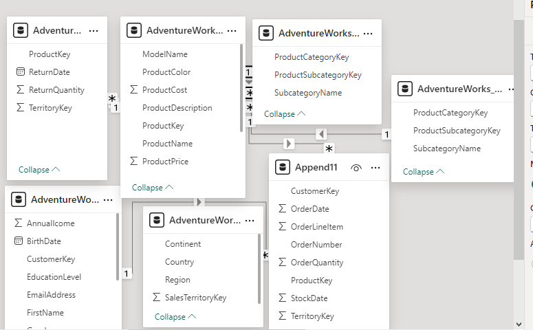
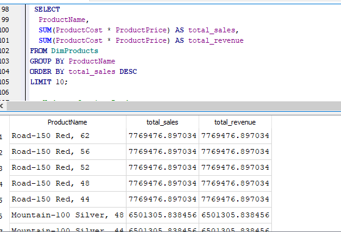
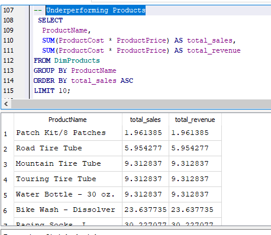
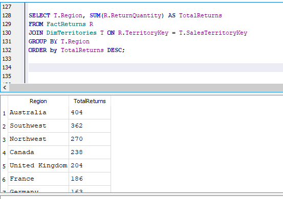
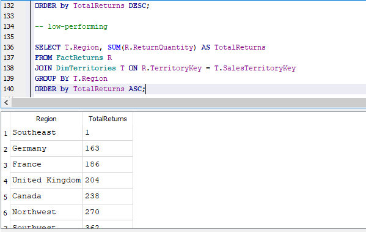
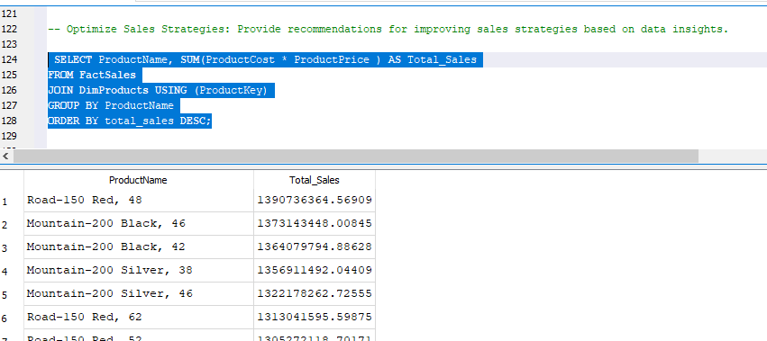
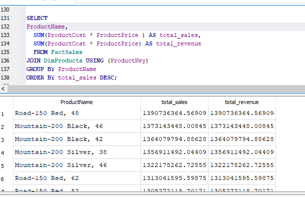
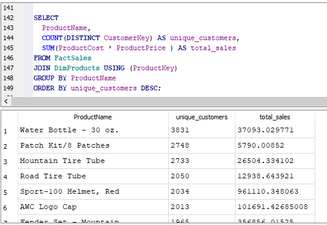

### Adventure_works_Analysis

### INTRODUCTION

This report analyzes the Adventure Works 2015,2016,2017 dataset to inform business decisions and drive growth. Focusing on sales, customers, and products, our analysis identifies key trends and patterns, providing actionable recommendations to enhance operations, customer engagement, and market expansion. SQLITE is use for Analysis and Exploration

### DATA IMPORTATION

The dataset is a CSV file and importing  files into SQLITE can be quite challenging especially using it for the first time and the date  is not the usual format for the default format that SQL recognizes. https://drive.google.com/drive/folders/1NBVyekPsFIB8Ajb9nhh22WX5eun9NyeW?usp=sharing

### DATA DICTIONARY

Customer: This table contains information about the customer whcih include CustomerKey	Prefix	FirstName	LastName	BirthDate	MaritalStatus	Gender	EmailAddress	AnnualIcome	TotalChildren	EducationLevel	Occupation	HomeOwner.
 
Product: This table contains information about the product , including ProductKey	ProductSubcategoryKey	ProductSKU	ProductName	ModelName	ProductDescription	ProductColor	ProductSize	ProductStyle	ProductCost	ProductPrice

Territory: This table contains information about sales territories, including SalesTerritoryKey	Region	Country	Continent

Product Categories: This table contains ProductCategoryKey	CategoryName

Product subcategories: This table contains detailed information about ProductSubcategoryKey	,SubcategoryName	,ProductCategoryKey

Returns: This table contains ReturnDate	TerritoryKey	ProductKey	ReturnQuantity

Calendar: This table contains Date

FACTS SALES: This table contains  all the sales tables from 2015, 2016 and 2017 respectively and it has the following informations as columns OrderDate	StockDate	OrderNumber	ProductKey	CustomerKey	TerritoryKey	OrderLineItem	OrderQuantity

### ENTITY RELATIONSHIP DIAGRAM

The Data Diagram also known as Entity Relationship Diagram (ERD or ER Diagram) is a type of flowchart that illustrates how “entities” relate to each other within a system or database. The data Diagram was drawn using power bi

We now have a diagram see Below for The Database Diagram for this Analysis.

### The Dataset is Reported clean and Ready for Analysis.

Below are the Questions and Queries that Provided answers to the questions

- Identify Sales Trends: Analyze sales data to uncover trends over time, including peak
periods and sales dips.

- Understand Customer Behavior: Examine customer demographics and purchasing
patterns to identify key customer segments and behaviors.

- Evaluate Product Performance: Assess the performance of different products,
including best-sellers and underperforming items

Best-Selling Products

  

Underperforming Products

 
 
- Analyze Territorial Differences: Compare sales performance across different regions
to identify high and low-performing areas

Higher-performing Territories

Low-performing Territories 

- Seasonal Impact: Determine the influence of seasonal trends on sales for various
product categories.

- Optimize Sales Strategies: Provide recommendations for improving sales strategies
based on data insights.

top-selling products:

-  Recommendations

  Foster strong relationships with customers through personalized communication and tailored sales approaches.
  
  Consider price adjustments for products with high demand or low sales to optimize revenue.
  
  Develop personalized sales strategies for high-value customers to increase loyalty and retention.

- Enhance Product Offerings: Suggest optimizations for product offerings based on
performance and customer preferences.

Product performance 

Customer preferences

- Product Optimization Suggestions

1. Discontinue underperforming products.
2. Increase production of best-selling products.
3. Offer product bundles based on customer purchasing patterns.
4. Improve product features based on customer ratings and feedback.
5. Expand product lines to cater to emerging customer preferences.
  
### INSIGHTS

1. Identify top-selling products and categories.
2. Analyze customer purchasing patterns and preferences.
3. Detect opportunities for product bundling.
4. Optimize product offerings based on performance and customer feedback.

### RECOMMENDATION

Regularly review sales data to identify trends, opportunities, and challenges, and adjust sales strategies accordingly.

Use historical data to inform sales forecasting and make data-driven decisions.

Encourage sales teams to test new approaches and measure their effectiveness.

Leverage tools like CRM software, sales automation platforms, and data analytics to support sales efforts.

Establish sales targets based on historical data and market trends to ensure achievable and motivating goals.

Align sales and marketing efforts to ensure consistent messaging and maximum impact.

Regularly review sales performance to identify areas for improvement and provide coaching and feedback.

### Thanks for reading! Pls do well to share your view in the comments section, I would be glad to discuss further on this analysis.

Follow me on www.linkedin.com/in/usman-muhammad-4992a3279

 

 
 

 

